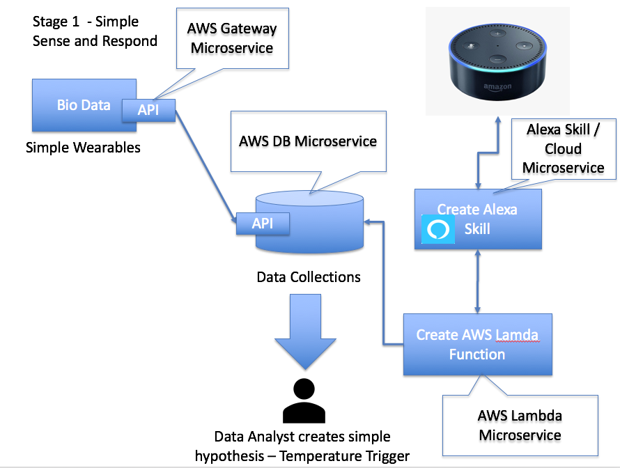
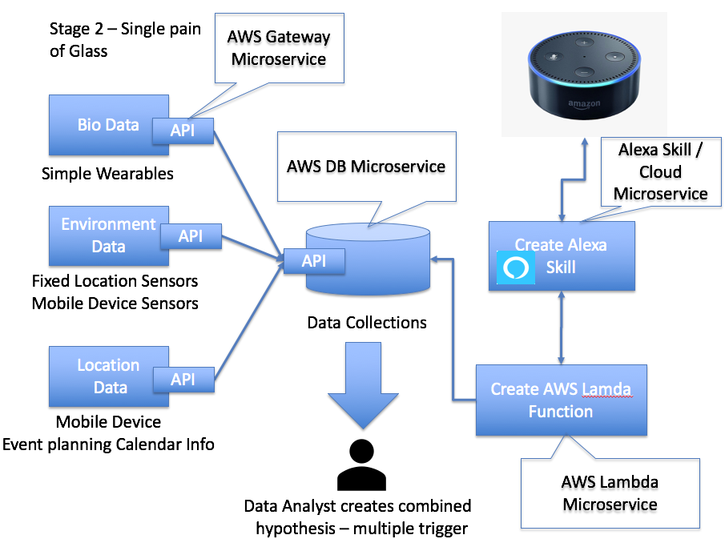
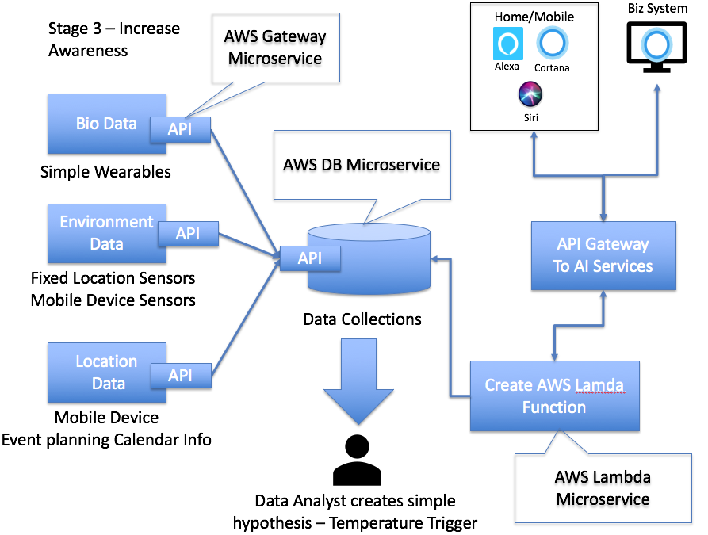
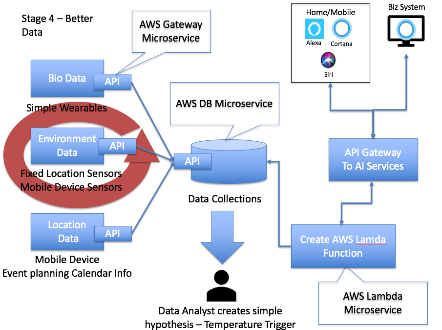
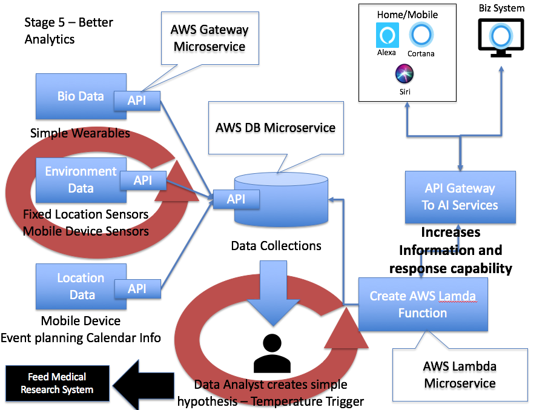

# Improving Quality of Life for Autism sufferers with AI

### Problem statement

People who suffer from Autism want to have a normal quality of life, however what are normal daily tasks / environmental and other events to none autism sufferers are major issues for people who suffer from this invisible mental issue. A lack of investment in social care, means that many people have to try to self heal and handle their activities without supporting systems and intelligence. If technology could provide patients with a non-intrusive monitoring, awareness and alerting service based on information processed by sensors and biometrics, Autism suffers, carers and family can be informed ahead of an issue, and corrective measure could be applied. The volume, variety and veracity of the data to be processed and responded too for a single human is not achievable let alone for 10's 100's of sufferers.

### Solution

Through the capture of data which relates to Biometrics, Environment and Location regarding an autism sufferer in realtime, the solution can apply a set of analytics to provide a response to Patient through mobile devices, Carer through response systems and or mobile devices, 3rd parties (family members).

Using AI - Create the a digital representation of an autism sufferer which takes information form sensors and data points to provide a realtime view of current state, analytics can be grown and applied to provided event and triggers through the processing of multiple information data sources to react/respond to known threats which can cause a suffer to have an episode.

### Cross Industry Applicability

Although this Data Story talks to the a specific mental illness, the ability to provide awareness and intelligence of a human based on various data signals. Could also be used in: -

  - <b>General Patient Care</b> - Home Care / Self Care (Reduce patient intake into hospitals, reduce GP time)
  - <b>Employee H&S</b> - Tracing certain workforce in high stress, highly dangerous situations.
  - <b>Personal Insurance</b> - Taking data collected from data points surrounds a persons general health could reduce Personal Health Policies

### Data Story

| Situational Awareness | Identify the Data | Augment Awareness | Automated Response |
|---------------------------|-------------------------|-------------------|--------------------|
| <b>Bio</b>                |                         |                   |                    |
| - Create awareness of current biometrics | develop a view of how certain bio metric data points (Heart, Stress, Temp) can be both sensed and aligned to behavioural patterns |  Bring the information steams together to provide a holistic view of the patient medical state |  Utilise algorithm to provide a response to Patient / Carer on trigger events that could cause the patient distress   |
| <b> Environment </b>    |                           |           |          |            |
| - Create awareness of environmental status | Develop a view of the environment the patient is currently in metric data points (Temp, Light Level, Humidity, Noise) can be both sensed and aligned to behavioural patterns  |  Crete a view of the overall environment status  |  Utilise algorithm to provide a response to Patient / Carer on trigger events that could cause the patient distress           |
| <b> Location </b>  |           |            |            |
| - Location awareness of patients, identify potential risk areas of human congestion | Develop a view of the location the patient is currently in (Map, Traffic, Underground Congestion, major events in Area)  | A location of patient, with a view of the current hot spots which should be avoided | Utilise algorithm to provide a response to Patient / Carer on trigger events that could cause the patient distress  |
| <b> Digital Human</b> | Aggregate the three dimension to create a full pain of glass view of the person | Data is aligned and tuned to identify combined trigger signs from previous events and analysis | Several response systems / channels are created, pushing notifications to Patients, Carers or Family and Friends | System intelligence can predict trends, identify patterns in behaviour and warn the people through AI interfaces the collaborate to instruct and respond to the needs of the person, whilst minimising discomfort.

### Transformation Plans

#### Approach

Development of this solution is done in an agile way with a define set of Program Increments which are achieved through a set of sprints.

| Program Increment | Description | Team Structure | Stage |
|-------------------|-------------|----------------|-------|
| Basic Sense and Response | Detail Below | Data Integration Lead, Alexa AI SME, Data Analyst, Mobile / Wearable Device SME | 1 |
| Single Pain of Glass | Detail Below | Data Integration Lead, Alexa AI SME, Data Analyst + API Specialist, Mobile / Wearable Device SME | 2 |
| Increase Awareness | Detail Below | Data Integration Lead, Cross AI SME (Cortana, Alexa, Siri),  Data Analyst + API Specialist) | 3 |
| Improve Data | Detail Below | Data Integration Lead, Data Scientist, API Specialist | 4  |
| Improve Analytics | Detail Below | Data Integration Lead, Data Scientist, Information Integration Lead  | 5  |

### Design Approach -

  - Start Simple Use available data and services - AWS / Alexa - General available data Scientist
    - Increase complexity overtime. 
  - Ensure each service talks through APIs
  - Prove value at each stage, feedback improvement into the Team
  - Utilise Agile technics - create backlog, develop Sprints, gain metrics on team capacity

#### Stage 1 (Basic Development of sensing Data and simple response to trigger)
- Focus on each domain to start, create a basic output which shows how data captured could have trigger levels applied to it and create a simple response

- Identify sample data sets across Bio, Environment and Location
    - Consider the ability to collect the data sources from everyday devices the sufferer feels conformable with
    - If additional sensors are required, these need to be no intrusive and not distracting to the sufferer (increase stress)

- Combine some common data within each set to augment the trigger level
- Send a basic response to Alexa / Cortana ("trigger level reached")

* Repeat for each domain, create simple sense and response through AI home based tooling

#### Stage 2 (Single Pain of glass insight)

- Combined data from Bio, Environment and Location to give a single view of the patients statement
- Consolidate / improve triggers to look at the combined data set
- Provide a single response to the AI system - Increase Information statement
  - " Carl is located <local>, the location is <Temp>, <Noisy>, his bio signals are <Heart rate, Stress level>"

#### Stage 3 - Increase awareness (Target the audience)

- Create AI skills / profiles for target audiences (Patient via Mobile, Family via Mobile/HomeAI, Career through Response systems)
- Provide tailored information which is relevant to audience
  - Patient - Instruct to move away, perform self help
  - Family / Friends - Informed, make contact.
  - Career - Engage / Support / Help.

- [Future] Beacon to inform emergency services that person they are dealing with has Autism. In certain situations an incorrect response by the emergency service who might be dealing with an issue, need to be informed that the individual suffers from a mental illness and maybe experiencing an episode, therefore will respond differently and need to be handle in the correct way.

#### Stage 4 -  Continuously Improve the analytics (New Data, Better Sensors, Better Algorithms)

- Sensors maybe basic to start, increase sensing capability
    - Introduce new data sets, new sensing devices
- Improve analytic, refine, increase accuracy, tailor to specific profiles (Male, Female, Age, Spectrum Level etc.....)

#### Stage 5 - (Deeper Insight, continuous development)

- Based on historical data, and tracking events and trigger signs, consider the development of deeper insight to symptoms, causes and detection points for autism to improve mental care, even pre-birth identification.

### KPIs

Performance Indicators

- Reduce autism suffer distress, reduce episodes
- Reduce demand on direct patient care - GPs / Hospitals

##### <b>Evidence 1</b> -

Autism has lifetime consequences, with potentially a range of impacts on the health, wellbeing, social integration and quality of life of individuals and families. Many of those impacts are economic. This study estimated the costs of autism spectrum disorders (ASDs) in the UK. Data on prevalence, level of intellectual disability and place of residence were combined with average annual costs of services and support, together with the opportunity costs of lost productivity. The costs of supporting children with ASDs were estimated to be pound 2.7 billion each year. For adults, these costs amount to pound 25 billion each year. The lifetime cost, after discounting, for someone with ASD and intellectual disability is estimated at approximately pound 1.23 million, and for someone with ASD without intellectual disability is approximately pound 0.80 million.

##### <b>Evidence 2</b> -

There are approximately 540,000 people with ASDs in the UK, of whom 433,000 are adults (aged 18 and over) and 107,000 are children.

- It is estimated that 55% of people with an ASD also have a learning disability.
- The aggregate cost of supporting people with ASDs in the UK is £27.5 billion annually.
- Of this, 59% is accounted for by services, 36% by lost employment for the individual with an ASD, their families and other carers, and the remainder by family expenses.
- The lifetime cost for someone with an ASD and a learning disability is estimated to be £4.7 million and £2.9 million for someone with a ‘high-functioning’ASD.
-	 Average annual costs for children with an ASD and a learning disability who are living in residential or foster placements range from £16,185 to £62,536. Costs were considerably lower if these children live with their families.
-	 Average annual costs for children with a high-functioning ASD range from £1,214 to £21,090 Average annual costs for adults with an ASD and a learning disability range from £36,507 to £97,863.
-	 Average annual costs for an adult with a high-functioning ASD range from £32,681 to £87,299.

##### <b>Evidence 3</b> -

Cost of autism to the UK economy is £32.1bn per year, compared to cancer (£12bn) heart disease (£8bn) and stroke (£5bn).
We spend just £4m per year on autism research, as compared to cancer (£590m) heart disease (£169m) or stroke (£32m).

### References - (UK based research to date)

[Industry Cost of Autism](http://www.lse.ac.uk/website-archive/newsAndMedia/newsArchives/2014/06/Autism.aspx)

[Human Cost of Autism](https://www.ncbi.nlm.nih.gov/pubmed/19369391)

[Government investment](https://www.independent.co.uk/voices/mental-health-government-jeremy-hunt-theresa-may-nhs-services-suicide-self-harm-a8220661.html)
