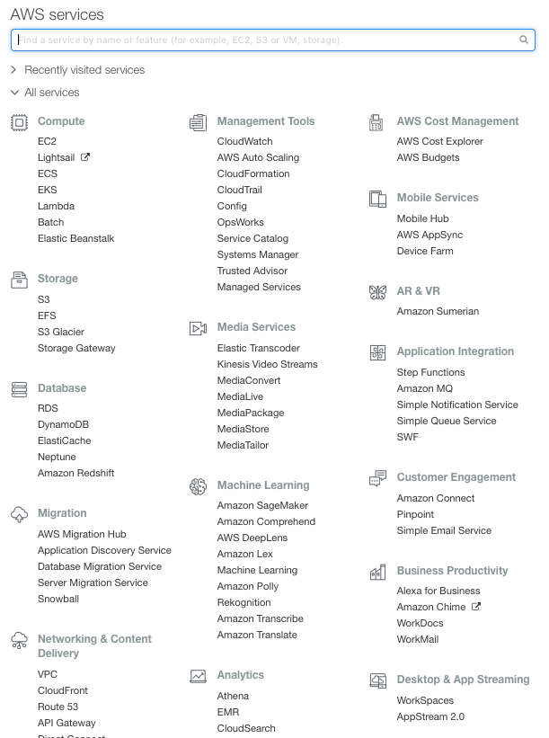

## Autism Project - Biometric Analysis and Response - Hack-athon

### General Statement -

People who suffer from Autism want to have a normal quality of life, however what are normal daily tasks / environmental and other events to none autism sufferers are major issues for people who suffer from this invisible mental issue. A lack of investment in social care, means that many people have to try to self heal and handle their activities without supporting systems and intelligence. If technology could provide patients with a non-intrusive monitoring, awareness and alerting service based on information processed by sensors and biometrics, Autism suffers, carers and family can be informed ahead of an issue, and corrective measure could be applied. The volume, variety and veracity of the data to be processed and responded too for a single human is not achievable let alone for 10's 100's of sufferers.

### Problem Statement -

Autism together (the client) is trying to provide better quality of life for its patients who suffer from Autism, the challenge today is that current monitoring and response is done by human interaction which is inefficient and costly. To improve the monitoring and response for for it patients the client has collected data from various sensors relating to a patients biometric and environmental levels, the client would like to be able to analysis the data and produce a response to various support functions based on certain triggers levels. The outcome should enable a patient to be monitored independent of a personal carer / family and support a better quality of life.

### Overview of Consider Solutions

Some consideration has been given the consider solution, although these are guidelines, teams have the option to develop a solution using any method they see fit.

[Reference User stories](./Data%20Story%20-%20Improve%20Care.md)

### Hack-athon scope

The Hack-athon event will focus on the

##### In-Scope
    - Data Storage in the Cloud
    - Turn the static Datasets into a simulated live feed
    - Data Processing - Ability to apply a simple query through code
    - Simple Event Trigger based on correlation of data events
    - Event Response through AI (Alexa)

##### Out of scope
    - Connecting to live data streams from devices
    - Multiple AI interfaces
    - Complex analytics Analysis
    - Security

#### Overview

Teams will aim to provide a solution that triggers an Alexa event by the analysis of a set of data held in a cloud ecosystem. The event will be based on the correlation of certain biometric and environmental triggers. (Heart Rate + Room Temperature)

Following a successful pattern match, an Alexa response should be triggered with a

  <b>"Hello World, I believe you need some help"</b>

### Preparation

Work Autism Together is doing and why.

  - https://www.autism.org.uk/about/behaviour/meltdowns.aspx
  - https://www.bbc.co.uk/news/av/health-44680214/the-watch-that-could-help-manage-severe-autism?SThisFB=

- Make sure you have a Github Account on https://github.com  
  - Please note we are using two github Repo's
    - 1: General Information Repo https://github.com/ckinson/Autism-Project (For reference Only / Data Sources)
    - 2: Your Team repo (detail below) - This is secure, all code, Data and information for your team is stored here.
- You are familiar with AWS Services
- Understand the Data you are looking at

### Tools

  - Code will reside on  Github under the following team spaces, teams will have access throught their Github userid's
  
    - Team 1 - https://github.com/ckinson/DTC-Hackathon-Team1
    - Team 2 - https://github.com/ckinson/DTC-Hackathon-Team2
    - Team 3 - https://github.com/ckinson/DTC-Hackathon-Team3
    - Team 4 - https://github.com/ckinson/DTC-Hackathon-Team4
    - Team 5 - https://github.com/ckinson/DTC-Hackathon-Team5
    - Team 6 - https://github.com/ckinson/DTC-Hackathon-Team6
    - Team 7 - https://github.com/ckinson/DTC-Hackathon-Team7

  - Any AWS service can be used -

  https://console.aws.amazon.com/console/home?region=us-east-1

  

  - Alexa will be the AI interface

    Alexa AI provides the ability to develop your own AI Skills, more information on this can be found here [LINK](https://developer.amazon.com/alexa-skills-kit)

### Data

These data sets are made up, based on nominal levels from various data sources.

Based on a 24hr monitoring session from a Biometrics Sensor, and two Environment covering Light and Temperature.

  - Three Data sets are provided
    - 1: Biometric from Off the self Personal Device (Fitbit or Other)
      - https://github.com/ckinson/Autism-Project/blob/master/Data/Biometrics-Data_Set-24Hrs.csv

    - 2: Light Levels
      - https://github.com/ckinson/Autism-Project/blob/master/Data/LightLUX-Data_Set-24Hrs.csv

    - 3: Location Temperature
      - https://github.com/ckinson/Autism-Project/blob/master/Data/RoomTemp-Data_Set-24Hrs.csv

 #### Raw Data - (optional) some data manipulation may be required.

 Below is data sent byt Autism Together, collected from the actual devices over a 21hr period.

 I’ve attached some CSV files for the Hackathon. You have some sample data from the environmental system on one spreadsheet and then separate sheets with the E4 (Bio-metric) data, the data we are keen on is the EDA, ACC and heart rate. Please note the accelerometer (ACC) data should be in 3 planes, x,y and z.

 https://github.com/ckinson/Autism-Project/tree/master/Data/Real_Data

### Added Credit

If the teams find that they complete the task, they is options to improve, considerations include

  - Create addition a Alexa response, targeting different personas
    - Consider
        - Patient - "Hi Carl, you need to move location"
        - Carers - "Carl is in trouble you need to contact him, it's his Body "
        - Family - " Carl is fine, but could do with you calling him"
  - Consider increase the Data set
    - Noise, Light (this will require creating a simple data set)
      - Noise (db) level measured during the time period
      - Light (Lux) Level measured during the time period
